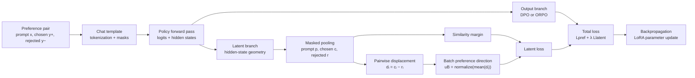
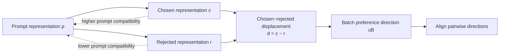
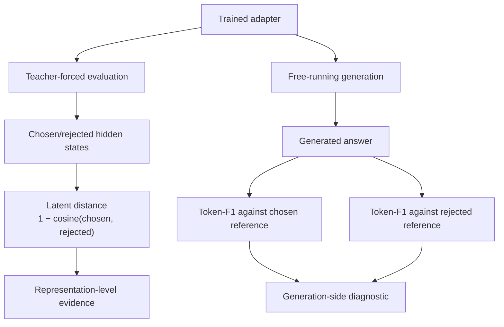

# Directional Latent Preference Optimization (DLPO)

A representation-aware regularizer for preference fine-tuning that augments DPO and ORPO with an explicit hidden-state preference objective.

[Paper draft](paper/main.pdf) · [Paper source](paper/main.tex) · [Implementation](dlpo/) · [Training script](scripts/train_preference.py)

> **Status:** Research prototype and paper draft. The current evidence supports a consistent change in hidden-state geometry, but does not yet establish a general behavioral or benchmark improvement.

## Overview

Direct Preference Optimization (DPO) and Odds Ratio Preference Optimization (ORPO) train a language model to assign higher probability to a chosen response than to a rejected response.

That objective specifies **which response wins**, but not necessarily **why it wins** internally.

Different hidden-state mechanisms can produce the same output-level preference margin. A model may learn the intended quality signal, or it may rely on a superficial correlate such as formatting, length, hedging, or a dataset-specific style marker.

Directional Latent Preference Optimization adds a second training signal that explicitly shapes the geometry of the model's hidden states.

DLPO combines:

1. A prompt–response similarity margin.
2. A batch-level chosen–rejected preference direction.
3. A standard output-level preference objective such as DPO or ORPO.

The resulting objective is:

$$
\mathcal{L}_{\mathrm{DLPO}} = \mathcal{L}_{\mathrm{pref}} + \lambda \mathcal{L}_{\mathrm{latent}}
$$

where:

- $\mathcal{L}_{\mathrm{pref}}$ is DPO or ORPO.
- $\mathcal{L}_{\mathrm{latent}}$ is the hidden-state preference regularizer.
- $\lambda$ controls the strength of the latent signal.

## Core idea

A transformer produces hidden states that are later projected into logits:

$$
z_t = W_{\mathrm{lm}}h_t + b
$$

$$
p(x_{t+1}\mid x_{\leq t}) = \operatorname{softmax}(z_t)
$$

DPO and ORPO supervise the output probabilities. DLPO additionally supervises the geometry of the hidden representations from which those probabilities are produced.



The intended geometric structure is:



DLPO does not assume that the learned direction is automatically “truthfulness,” “helpfulness,” “safety,” or “reasoning quality.” It imposes a geometric inductive bias; the meaning of that geometry still depends on the data and model.

## Mathematical formulation

### Preference data

The training set contains preference triples:

$$
\mathcal{D} = \left\{ (x_i,y_i^+,y_i^-) \right\}_{i=1}^{n}
$$

where:

- $x_i$ is the prompt.
- $y_i^+$ is the chosen response.
- $y_i^-$ is the rejected response.

The expected data format is:

```json
{
  "prompt": "Explain gradient descent.",
  "chosen": "A clear and accurate explanation...",
  "rejected": "A vague or less useful explanation..."
}
```

### Masked hidden-state pooling

Let $H \in \mathbb{R}^{T \times d}$ be the hidden states for a sequence and $m$ be a binary token mask.

The default response representation is a masked mean:

$$
\operatorname{Pool}_{m}(H) = \frac{\sum_{t=1}^{T}m_tH_t}{\max\left(\sum_{t=1}^{T}m_t,1\right)}
$$

For each preference pair, DLPO computes:

$$
c_i = \operatorname{Pool}_{m_+}\left(H_\theta(x_i,y_i^+)\right)
$$

$$
r_i = \operatorname{Pool}_{m_-}\left(H_\theta(x_i,y_i^-)\right)
$$

The prompt representation is estimated from the prompt-prefix states of both sequences:

$$
p_i
=
\frac{1}{2}
\left(
p_i^{(+)}+p_i^{(-)}
\right)
$$

Because chosen and rejected examples share the same rendered prompt prefix, the two prompt-prefix representations should agree under deterministic causal evaluation.

### Output-level preference loss

For DPO, the preference margin is:

$$
\Delta_{\mathrm{DPO},i} = \left[\log\pi_\theta(y_i^+\mid x_i)- \log\pi_\theta(y_i^-\mid x_i)\right] - \left[\log\pi_{\mathrm{ref}}(y_i^+\mid x_i) - \log\pi_{\mathrm{ref}}(y_i^-\mid x_i)\right]
$$

The DPO loss is:

$$
\mathcal{L}_{\mathrm{DPO}}
=
\mathbb{E}_i
\left[
\operatorname{softplus}
\left(
-\beta\Delta_{\mathrm{DPO},i}
\right)
\right]
$$

For ORPO, the loss combines chosen-response supervised fine-tuning with an odds-ratio preference term:

$$
\mathcal{L}_{\mathrm{ORPO}} = \mathbb{E}_i[-\bar{\ell}_{\theta,i}^{+}] + \alpha\mathbb{E}_i\left[\operatorname{softplus}\left(-\Delta_{\mathrm{ORPO},i}\right)\right]
$$

ORPO is reference-free. DPO requires a frozen reference model.

### Prompt–response similarity term

DLPO first computes a prompt-relative similarity margin:

$$
s_i = \operatorname{cos}(p_i,c_i) - \operatorname{cos}(p_i,r_i)
$$

The corresponding soft-margin loss is:

$$
\mathcal{L}_{\mathrm{sim}} = \mathbb{E}_i\left[\operatorname{softplus}\left(\gamma(m-s_i)\right)\right]
$$

This encourages:

$$
\operatorname{cos}(p_i,c_i)
\geq
\operatorname{cos}(p_i,r_i)+m
$$

The term is geometric rather than semantic. It can reward any feature that changes hidden-state compatibility, including useful features and superficial proxies.

### Batch preference-direction term

For a mini-batch $B$, define the chosen–rejected displacement:

$$
d_i = c_i-r_i
$$

The batch mean displacement is:

$$
\bar{d}_B = \frac{1}{|B|}\sum_{i\in B}d_i
$$

The batch preference direction is:

$$
u_B = \frac{\bar{d}_B}{\max(\|\bar{d}_B\|_2,\varepsilon)}
$$

Each pairwise displacement is then aligned with the batch direction:

$$
a_i = \left\langle \frac{d_i}{\sqrt{\|d_i\|_2^2+\varepsilon}}, u_B\right\rangle
$$

The directional loss is:

$$
\mathcal{L}_{\mathrm{dir}} = \mathbb{E}_{i\in B}\left[\operatorname{softplus}(-\gamma a_i)\right]
$$

This term encourages preference pairs in the same batch to share a reusable direction in hidden space.

When both latent components are enabled:

$$
\mathcal{L}_{\mathrm{latent}} = \frac{1}{2}\left(\mathcal{L}_{\mathrm{sim}} + \mathcal{L}_{\mathrm{dir}}\right)
$$

If only one component is enabled, that component is used without the factor of one-half.

### Properties

The latent margins are bounded:

$$
s_i \in [-2,2]
$$

$$
a_i \in [-1,1]
$$

In the idealized unstabilized limit, the objectives are invariant to isotropic rescaling of hidden states. The implementation uses numerical stabilizers, so it should be understood as piecewise smooth near the stabilization thresholds.

## Training methodology

Each training step follows this sequence:

1. Sample a batch of preference pairs.
2. Render prompts using the model's chat template.
3. Tokenize chosen and rejected sequences.
4. Construct prompt and response masks.
5. Run the policy on both sequences.
6. Compute DPO or ORPO.
7. Pool prompt, chosen, and rejected hidden states.
8. Compute similarity and directional latent losses.
9. Add the latent regularizer to the preference loss.
10. Update LoRA parameters.

```python
for batch in preference_loader:
    chosen_logits, chosen_hidden = policy(chosen_tokens)
    rejected_logits, rejected_hidden = policy(rejected_tokens)

    preference_loss = dpo_or_orpo(
        chosen_logits,
        rejected_logits,
        reference_model,
    )

    prompt_repr = pool_prompt(chosen_hidden, rejected_hidden)
    chosen_repr = pool_answer(chosen_hidden)
    rejected_repr = pool_answer(rejected_hidden)

    similarity_loss = prompt_response_margin(
        prompt_repr,
        chosen_repr,
        rejected_repr,
    )

    direction_loss = batch_direction_alignment(
        chosen_repr - rejected_repr
    )

    latent_loss = average_active_components(
        similarity_loss,
        direction_loss,
    )

    total_loss = preference_loss + latent_weight * latent_loss
    update_lora_parameters(total_loss)
```

The implementation captures optional intermediate hidden states while preserving the model's native final-layer logits for the output-level loss.

The additional latent computation is approximately:

$$
O(BTd)
$$

after the transformer forward pass, while the dominant cost remains the transformer and vocabulary projection. DLPO-ORPO remains reference-free; DLPO-DPO requires the same frozen reference-model computation as ordinary DPO.

## Algorithms

| CLI algorithm | Output objective | Reference model | Latent objective |
|---|---|---:|---|
| `dpo` | DPO | Yes | Disabled |
| `dlpo-dpo` | DPO | Yes | Enabled |
| `orpo` | ORPO | No | Disabled |
| `dlpo-orpo` | ORPO | No | Enabled |
| `lpo` | None | No | Latent-only ablation |

The primary proposed variants are `dlpo-dpo` and `dlpo-orpo`. Pure `lpo` is included as an ablation baseline.

## Configurable latent design

The implementation exposes three main latent choices.

### Latent variant

```text
similarity
direction
both
```

### Pooling operator

```text
answer_mean
last_token
last_k_mean
prompt_answer_mean
```

The default is `answer_mean`.

Mean pooling spreads the latent gradient across the response positions. `last_token` pooling concentrates it on the final active response position.

### Hidden-state layer

```text
final
middle
late
<int>
```

The final residual stream is the default used in the headline analysis.

The initial layer-placement study was withdrawn because its earlier implementation changed the logit source of the preference loss. No layer-localization claim is made until corrected, provenance-pinned reruns are complete.

## Experimental evidence

The paper evaluates thirteen matched baseline/regularized adapter pairs across:

- Qwen2.5, Qwen3, and Llama 3 backbones.
- `Human-Like-DPO`.
- `JOSIE-2-DPO`.
- DPO and ORPO objective families.

The central result is geometric:

> Every matched DLPO run increased the teacher-forced chosen–rejected hidden-state cosine distance, and every paired bootstrap interval excluded zero.

Representative results:

| Model | Dataset | Objective | Base distance | DLPO distance | Difference |
|---|---|---:|---:|---:|---:|
| Qwen2.5-0.5B | Human-Like-DPO | DPO | 0.104 | 0.693 | +0.589 [0.494, 0.674] |
| Qwen2.5-0.5B | JOSIE-2-DPO | ORPO | 0.050 | 0.879 | +0.829 [0.698, 0.938] |
| Qwen2.5-1.5B | Human-Like-DPO | ORPO | 0.110 | 0.371 | +0.261 [0.179, 0.344] |

The intervals are prompt-level paired bootstrap intervals over 10,000 resamples. They quantify evaluation-resampling uncertainty conditional on the trained adapters; they do not measure training-seed variation.

### What remains unresolved

The generation-side metric is the chosen-reference F1 fraction:

> The fraction of generated answers with higher token-level F1 overlap with the chosen reference than with the rejected reference.

This is not a judged preference win rate and is not a direct contest between baseline and DLPO generations.

All paired intervals for this metric contain zero. The generation sample contains only 16 examples per row, so one example changes the fraction by approximately 0.06.

The current evidence therefore supports:

- A consistent change in hidden-state geometry.
- No reliable conclusion about downstream behavioral improvement.
- No claim that DLPO eliminates shortcut learning or reward hacking.

## Visual analysis

The repository includes PCA, UMAP, loss-curve, pooling, and latent-weight visualizations.

### ORPO versus DLPO-ORPO


ORPO and DLPO-ORPO have similar scalar loss curves, while their answer hidden-state projections differ substantially. This illustrates the central motivation for inspecting representation geometry in addition to probability-level loss.

### Pooling ablation


This ablation compares `answer_mean`, `last_token`, `last_k_mean`, and `prompt_answer_mean` pooling. In the small Qwen2.5-0.5B experiment, `last_token` produced the strongest latent similarity margin, but this result is limited to a single small setting.

### Latent-weight ablation


The latent coefficient can substantially change hidden-state organization even when scalar preference losses remain nearly unchanged.

## Evaluation interpretation

The repository intentionally separates teacher-forced geometry from free-running generation behavior.



The latent distance is computed on the dataset's provided chosen and rejected responses. It does not measure the hidden states of generated answers.

## Reproducibility

This project uses MLX and LoRA.

### Installation

MLX is intended primarily for Apple silicon systems.

```bash
python3 -m venv .venv
source .venv/bin/activate
python -m pip install -e .
```

### Train DLPO-ORPO

The following is an illustrative 500-example training configuration with a 128-example validation split:

```bash
python3 scripts/train_preference.py \
  --algorithm dlpo-orpo \
  --model Qwen/Qwen2.5-1.5B-Instruct \
  --dataset mlx-community/Human-Like-DPO \
  --dataset-file data/train-00000-of-00001.parquet \
  --max-examples 500 \
  --validation-examples 128 \
  --batch-size 2 \
  --iters 250 \
  --learning-rate 1e-5 \
  --max-seq-length 512 \
  --orpo-alpha 0.1 \
  --latent-weight 0.1 \
  --latent-margin 0.05 \
  --latent-gamma 10.0 \
  --latent-variant both \
  --pooling answer_mean \
  --layer final \
  --lora-layers 16 \
  --lora-rank 8 \
  --lora-scale 20.0 \
  --lora-dropout 0.0 \
  --seed 42 \
  --output-dir outputs/dlpo-orpo
```

### Train an ORPO baseline

Use the same configuration while disabling the latent path:

```bash
python3 scripts/train_preference.py \
  --algorithm orpo \
  --model Qwen/Qwen2.5-1.5B-Instruct \
  --dataset mlx-community/Human-Like-DPO \
  --dataset-file data/train-00000-of-00001.parquet \
  --max-examples 500 \
  --validation-examples 128 \
  --batch-size 2 \
  --iters 250 \
  --learning-rate 1e-5 \
  --max-seq-length 512 \
  --orpo-alpha 0.1 \
  --latent-weight 0.0 \
  --seed 42 \
  --output-dir outputs/orpo
```

For local JSONL data, replace the dataset arguments with:

```bash
--data-path custom_datasets/markdown/train.jsonl
```

### Generation evaluation

```bash
python3 scripts/generation_eval.py \
  --model Qwen/Qwen2.5-1.5B-Instruct \
  --dataset mlx-community/Human-Like-DPO \
  --dataset-file data/train-00000-of-00001.parquet \
  --adapter-dir outputs/orpo \
  --adapter-dir outputs/dlpo-orpo \
  --outputs-dir outputs \
  --validation-examples 128 \
  --eval-examples 16 \
  --max-tokens 128
```

### Hidden-state comparison

```bash
python3 scripts/hidden_state_comparison.py \
  --model Qwen/Qwen2.5-1.5B-Instruct \
  --dataset mlx-community/Human-Like-DPO \
  --dataset-file data/train-00000-of-00001.parquet \
  --adapter-dir base=outputs/orpo \
  --adapter-dir dlpo=outputs/dlpo-orpo \
  --validation-examples 128 \
  --eval-examples 128 \
  --max-seq-length 512
```

Every training run records:

- `adapter_config.json`: model, algorithm, LoRA, and training parameters.
- `provenance.json`: dataset hash, pair identifiers, and source-code hashes.
- `metrics.jsonl`: training metrics.
- `validation_metrics.jsonl`: validation metrics.
- `generation_eval.jsonl`: per-example generation metrics.

Exact paper reproduction should use the configuration stored with each artifact. The command-line defaults are convenience defaults and are not guaranteed to match every historical paper cell.

## Repository structure

```text
.
├── dlpo/
│   ├── losses.py              # DPO, ORPO, LPO, and DLPO losses
│   ├── mlx_ops.py             # MLX forward capture, pooling, normalization
│   ├── tokenization.py        # Chat rendering, tokenization, masks
│   ├── data.py                # Preference dataset loading and batching
│   ├── hidden_analysis.py     # Representation summaries and plots
│   └── diagnostics.py         # Statistical diagnostic utilities
├── scripts/
│   ├── train_preference.py    # Main training entry point
│   ├── generation_eval.py     # Free-running generation evaluation
│   ├── hidden_state_comparison.py
│   ├── run_full_ablation_matrix.py
│   ├── run_latent_weight_ablation_matrix.py
│   ├── run_pooling_ablation_matrix.py
│   └── run_layer_ablation_matrix.py
├── custom_datasets/           # Local preference datasets
├── outputs-*/                 # Training artifacts and manifests
├── paper/
│   ├── main.tex               # Paper source
│   ├── main.pdf               # Compiled paper
│   ├── references.bib
│   └── media/                  # Figures and visual comparisons
├── tests/                     # Unit tests
└── pyproject.toml
```

## Limitations

DLPO should not be interpreted as a general alignment guarantee.

- A hidden-state separation can encode a superficial marker instead of the intended preference criterion.
- The similarity and directional terms are inductive biases, not semantic reward models.
- Batch size one makes the directional component degenerate because the batch direction becomes the single example's direction. Use batch size greater than one to test the directional term.
- The current headline experiments use a single training seed.
- Generation evaluation uses only 16 examples per adapter.
- The generation metric is lexical overlap, not human or model-judged preference.
- The datasets are small and narrow compared with broad alignment benchmarks.
- The paper does not establish improvements on MMLU, MT-Bench, AlpacaEval, reasoning benchmarks, or other benchmark suites.
- The causal role of the learned direction has not been established through activation steering or ablation.
- The original layer-placement and shortcut-association studies were withdrawn after implementation and statistical confounds were identified.
- No claim is made that DLPO eliminates reward hacking or shortcut reliance.

## Related work

- [Direct Preference Optimization](https://arxiv.org/abs/2305.18290)
- [ORPO: Monolithic Preference Optimization without Reference Model](https://arxiv.org/abs/2403.07691)
- [Steering Language Models With Activation Engineering](https://arxiv.org/abs/2308.10248)
- [Refusal in Language Models Is Mediated by a Single Direction](https://arxiv.org/abs/2406.11717)
- [Representation Engineering](https://arxiv.org/abs/2310.01405)
- [MLX](https://github.com/ml-explore/mlx)
- [MLX-LM-LoRA](https://github.com/Goekdeniz-Guelmez/mlx-lm-lora)
